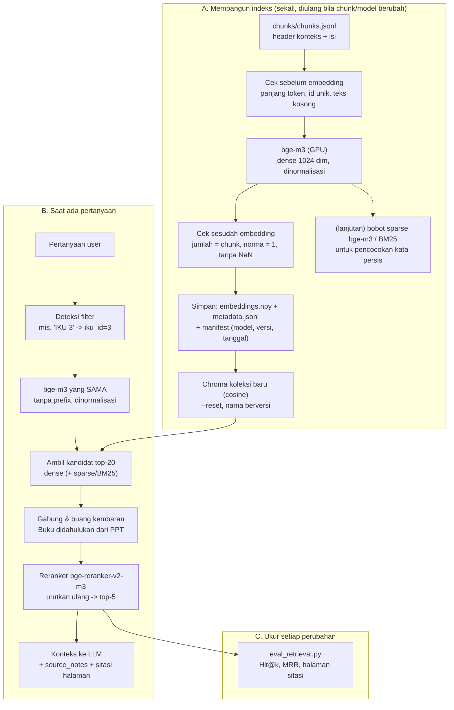

# Skema Best Practice Embedding (bge-m3)

Dokumen ini menjelaskan **alur embedding yang disarankan** untuk chatbot IKU, aturan yang harus dijaga di setiap tahap, dan **status penerapannya** di proyek saat ini.

Rujukan utama: [model card BAAI/bge-m3](https://huggingface.co/BAAI/bge-m3) dan [Anthropic – Contextual Retrieval](https://www.anthropic.com/news/contextual-retrieval).

## 1. Gambaran alur

## 2. Aturan per tahap

### A. Membangun indeks

| # | Aturan | Alasan | Status |
|---|---|---|---|
| A1 | **Embed teks berkonteks** (header + isi), simpan isi asli terpisah | Chunk tetap bermakna walau dibaca terpisah; teknik ini menurunkan kegagalan retrieval secara nyata (Anthropic) | ✅ field `text` di-embed, `content` disimpan |
| A2 | **Batas panjang model ≥ panjang chunk terpanjang** | Teks yang melebihi batas dipotong diam-diam oleh model, jadi informasinya hilang | ✅ chunk ≤ 512 token, `max_seq_length = 1024` |
| A3 | **Dokumen tanpa prefix/instruksi** | bge-m3 tidak memerlukan instruksi pada query maupun dokumen (model card) | ✅ |
| A4 | **Normalisasi vektor + jarak cosine** | Yang dibandingkan arah (makna), bukan panjang teks; cosine cocok untuk vektor ternormalisasi | ✅ `normalize_embeddings=True`, Chroma `hnsw:space=cosine` |
| A5 | **Model yang sama untuk dokumen dan query**, versi dicatat | Vektor dari model atau versi berbeda tidak bisa dibandingkan | ✅ model sama · ⬜ versi model belum dicatat di manifest |
| A6 | **Cek sebelum dan sesudah embedding**: id unik, tidak ada teks kosong, jumlah vektor = jumlah chunk, norma ≈ 1, tidak ada NaN | Menangkap kesalahan diam-diam sebelum masuk database | 🟡 jumlah dicek di `build_chroma.py`; cek lain belum |
| A7 | **Bangun ulang koleksi dari nol** (`--reset`) dengan **nama berversi** (`pmpt_qa_v2`) | `upsert` tidak menghapus chunk usang; nama berversi menjaga pembanding lama | ✅ |
| A8 | **Simpan manifest**: model, revisi, dimensi, jumlah chunk, tanggal, hash file chunk | Bisa dilacak, misalnya "koleksi ini dibangun dari chunk yang mana?" | ⬜ |
| A9 | **GPU + batch wajar** (8; turunkan bila *out of memory*) | Cepat tanpa kehabisan memori di RTX 4050 6 GB | ✅ `--batch-size` |
| A10 | (Lanjutan) **Simpan representasi kata persis**: bobot *sparse* bge-m3 atau indeks BM25 | Embedding dense lemah untuk "IKU 4" vs "IKU 5", "NUPTK", "MDPI"; model card menyarankan hybrid | ⬜ |

### B. Saat pencarian

| # | Aturan | Alasan | Status |
|---|---|---|---|
| B1 | **Query diproses dengan model, normalisasi, dan tanpa prefix yang sama** dengan dokumen | Konsistensi "peta makna" | ✅ |
| B2 | **Ambil kandidat lebih banyak dari yang dipakai** (top-20 → top-5) | Memberi ruang bagi tahap penggabungan dan reranker | ✅ `Retriever.v2`: 30 kandidat → top-5 |
| B3 | **Filter metadata bila pertanyaan menyebut IKU** (`iku_id`, `jenis`) | Mencegah IKU 4 tertukar dengan IKU 5 | ✅ deteksi "IKU N" + maksud pertanyaan (definisi/rumus) |
| B4 | **Hybrid: dense + sparse/BM25**, digabung dengan *Reciprocal Rank Fusion* | Menangkap makna dan kata persis sekaligus | ✅ BM25 + RRF (`--hybrid`) |
| B5 | **Buang kembaran dan dahulukan Buku** (`source_priority`); PPT hanya bila informasinya tidak ada di Buku | Isi Buku/PPT/Lampiran banyak yang kembar dan PPT punya kesalahan ("6 IKU wajib") | ✅ salinan dicatat di `also_in` |
| B6 | **Reranker cross-encoder** (`bge-reranker-v2-m3`) pada kandidat | Lebih akurat daripada bi-encoder (model card); Anthropic melaporkan penurunan kegagalan terbesar saat reranker ditambahkan | 🟡 tersedia (`--rerank`), belum diukur karena perlu unduh ±2 GB |
| B7 | **Jangan buang hasil hanya karena pendek** (filter < 80 karakter) | Fakta pendek tetap penting; chunk v2 sudah tidak ada yang kosong | ✅ `min_chars=0` di v2 |
| B8 | **Kirim `source_notes` ke LLM** bersama chunk-nya | Agar LLM tahu angka yang cacat di dokumen sumber | ⬜ (retriever sudah mengembalikannya) |
| B9 | **Jangan pakai ambang distance untuk menolak pertanyaan** | Evaluasi menunjukkan distance soal relevan dan tidak relevan tumpang-tindih; penolakan ditangani lewat prompt LLM | ✅ (keputusan desain) |

### C. Pengukuran

| # | Aturan | Status |
|---|---|---|
| C1 | Setiap perubahan (chunking, model, retriever) **dievaluasi dengan test set yang sama** dan dibandingkan dengan baseline | ✅ `eval_retrieval.py` |
| C2 | **Ubah satu hal setiap kali**, supaya jelas perubahan mana yang berdampak | Kebiasaan kerja |
| C3 | Catat hasil setiap percobaan (koleksi, pengaturan, Hit@1/Hit@5/MRR) dalam satu tabel | ⬜ |

## 3. Urutan pengerjaan yang disarankan

Diurutkan dari **dampak terbesar dan usaha terkecil**. Setiap langkah diakhiri dengan `eval_retrieval.py`.

| Urutan | Langkah | Aturan | Usaha |
|---|---|---|---|
| 0 | Jalankan embedding + Chroma v2, evaluasi → **baseline baru** | A1–A7 | Sudah siap dijalankan |
| 1 | Cek kesehatan embedding + manifest | A6, A8 | Kecil |
| 2 | Retriever: top-20 → buang kembaran, dahulukan Buku → top-5; hapus filter < 80 karakter | B2, B5, B7 | Kecil |
| 3 | Filter metadata bila pertanyaan menyebut nomor IKU | B3 | Kecil |
| 4 | Hybrid dense + sparse/BM25 dengan RRF | A10, B4 | Sedang |
| 5 | Reranker `bge-reranker-v2-m3` | B6 | Sedang (model ±2 GB, GPU cukup) |
| 6 | Sambungkan ke LLM: konteks + `source_notes` + sitasi | B8 | Bagian tahap jawaban |

## 4. Hal yang sebaiknya dihindari

- **Mengganti model embedding tanpa membangun ulang seluruh indeks.** Vektor lama dan baru tidak bisa dicampur.
- **Mencampur jarak L2 dan cosine** saat membandingkan angka distance antar-koleksi. Bandingkan Hit@k/MRR, bukan distance.
- **Meng-embed teks tanpa konteks** (isi saja tanpa header), karena kartu kehilangan identitasnya.
- **Chunk melebihi batas model.** Bagian akhirnya terpotong tanpa peringatan.
- **Menambah banyak perbaikan sekaligus.** Kalau hasil berubah, tidak jelas mana penyebabnya.
- **Menilai dari satu atau dua pertanyaan saja.** Selalu pakai test set lengkap.

## 5. Hasil penerapan (test set 30 soal, koleksi `pmpt_qa_v2`)

| Konfigurasi | Hit@1 | Hit@5 | Hit@5 gabungan | MRR | Halaman sitasi benar | Sitasi dari Lampiran | #1 dari PPT |
|---|---|---|---|---|---|---|---|
| Dense saja (baseline) | 18/29 | 25/29 | 25/29 | 0,730 | 13/23 | 10 | 8 |
| + 30 kandidat, tanpa filter 80 karakter | 18/29 | 25/29 | – | 0,730 | 13/23 | 10 | 8 |
| + dedupe (Bab V didahulukan) | 18/29 | 26/29 | – | 0,733 | 25/26 | 1 | 1 |
| + deteksi IKU di pertanyaan | 21/29 | 26/29 | – | 0,799 | 25/26 | 1 | 0 |
| + hybrid BM25 | 21/29 | 26/29 | 27/29 | 0,796 | 25/26 | 0 | 0 |
| **+ maksud pertanyaan (preset v2)** | **22/29** | **26/29** | **27/29** | **0,822** | **25/26** | **0** | **0** |

Uji soal hitungan (`run_calc_tests.py`): hasil hitung 18/18, halaman sitasi 17/18, semua dari Bab V Buku.

Perintah: `python src/evaluation/eval_retrieval.py --collection pmpt_qa_v2 --metadata data/embeddings/metadata.jsonl --oos-threshold 0.45 --preset v2`
